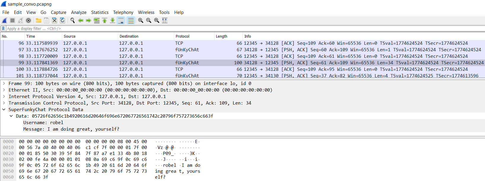

# TCP Dissector for the SuperFunkyChat Protocol

This is a Wireshark protocol parser written in Lua for the SuperFunkyChat program.

In the book *Attacking Network Protocols*, James Forshaw writes the UDP version of the parser, however, this implementation is for TCP.

The TCP version is slightly more difficult due to the fact that you must account for split or multiple packets which requires some conditional logic to parse the data correctly.

Below is an example of how the parsed protocol looks in Wireshark.

